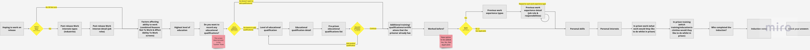

The Induction, previously known as the "CIAG Induction", is performed soon after the prisoner enters prison, and it's
purpose is to collect background information about the prisoner, their education, skills and interests, and their
future work aspirations.

The Induction data is presented and collected using a typical GDS wizard style sequence of screens, where the answers to
questions will determine the question set. Broadly speaking there is a short question set for when the prisoner either
doesn't want or is not sure if they want to work on release. The long question set is asked when the prisoner does want
to work on release. There are some additional subtleties within these 2 question sets based on the answers to questions,
but in general the terms "short question set" and "long question set" are used.

The original documentation for the Induction screens describing the short and long question is documented [in this miro board](https://miro.com/app/board/uXjVKe-qkvg=/?share_link_id=489629926382).
